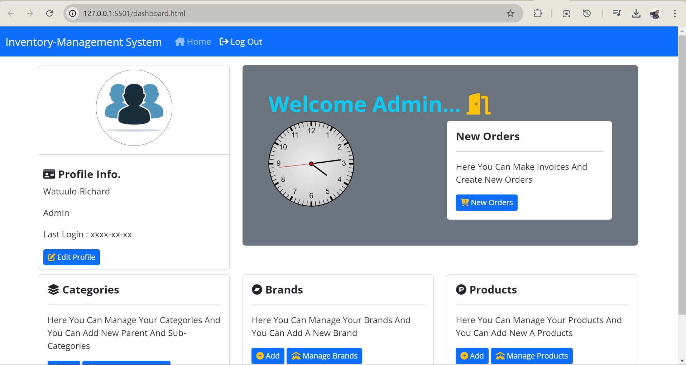

# Inventory Management System

This is a simple Inventory Management System built using **React** and **Bootstrap 5**. It helps users to manage stock, track inventory, and handle product data efficiently.

While Bootstrap 5 is used for quick and responsive design, you can also use **plain CSS** to further style and customize the user interface.



---

## Features
- Manage product listings
- Track inventory levels
- Add, edit, and delete items
- Search and filter products
- Responsive UI with Bootstrap 5
- Option to add custom styling using plain CSS

---

## Project Setup

To get started with the project, follow the steps below:

### 1. Fork the Project
You can create a copy of this project in your GitHub account by forking it.

- Go to the GitHub repository: [GitHub Repository URL]
- Click on the "Fork" button on the top-right corner of the repository page.
- This will create a fork (copy) of the project in your GitHub account.

### 2. Clone the Forked Repository
Once the project is forked, clone the repository to your local machine using the following command:

```bash
git clone https://github.com/your-username/inventory-management-system.git

## Features

- Modern layout with custom colors/styles/backgrounds
- Responsive design
- Sticky navbar with style changes on scroll
- Bootstrap modals
- Form & input styles
- Testimonials
- Contact page with Google Map

## Usage

This website is built with [Bootstrap](https://getbootstrap.com/) and It uses [Font Awesome](https://fontawesome.com/) for icons.

